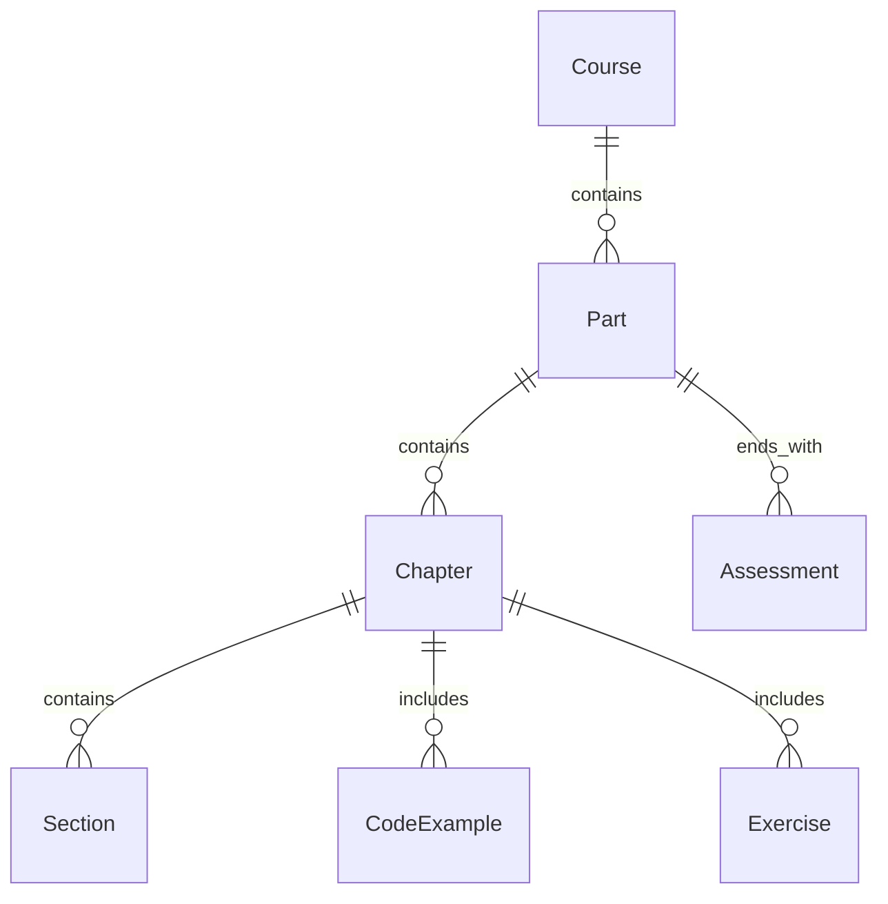

# Data Model: Textbook Content

## Entity Hierarchy

The content is structured hierarchically to map to the Docusaurus sidebar and file system.



## Entities

### 1. Part
- **Definition**: A major thematic module of the course (e.g., "Part 2: ROS 2 Fundamentals").
- **Storage**: Directory `docs/part-XX-slug/`.
- **Metadata (`_category_.json`)**:
  - `label`: Display name (e.g., "Part 2: ROS 2").
  - `position`: Ordering integer (1-6).
  - `link`: Link to introduction page.

### 2. Chapter
- **Definition**: A single teaching unit designed for a 20-30 minute reading session.
- **Storage**: Directory `docs/part-XX/chapter-YY-slug/index.md`.
- **Frontmatter**:
  ```yaml
  title: "Chapter Title"
  description: "Brief summary for SEO and preview."
  sidebar_position: 1 # Integer, 1-10 within the Part
  tags: [ros2, python, basics]
  hide_table_of_contents: false
  ```

### 3. Code Example
- **Definition**: A block of code (Python, C++, XML/URDF, Bash).
- **Types**:
  - `Complete`: Fully runnable, self-contained.
  - `Illustrative`: Snippet marked with "Excerpt".
- **Representation**: MDX Code Block with optional title and language identifier.

### 4. Assessment
- **Definition**: End-of-Part verification milestone.
- **Storage**: `docs/part-XX/99-assessment/index.md` (or similar high index).
- **Frontmatter**:
  ```yaml
  title: "Part X Assessment"
  sidebar_position: 99
  ```
